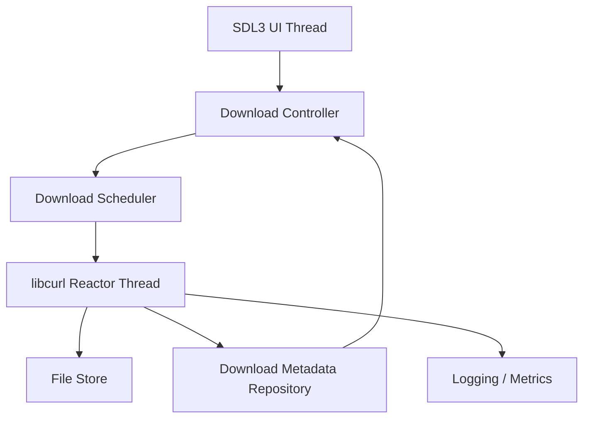
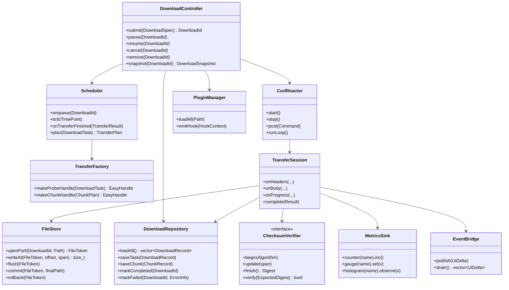
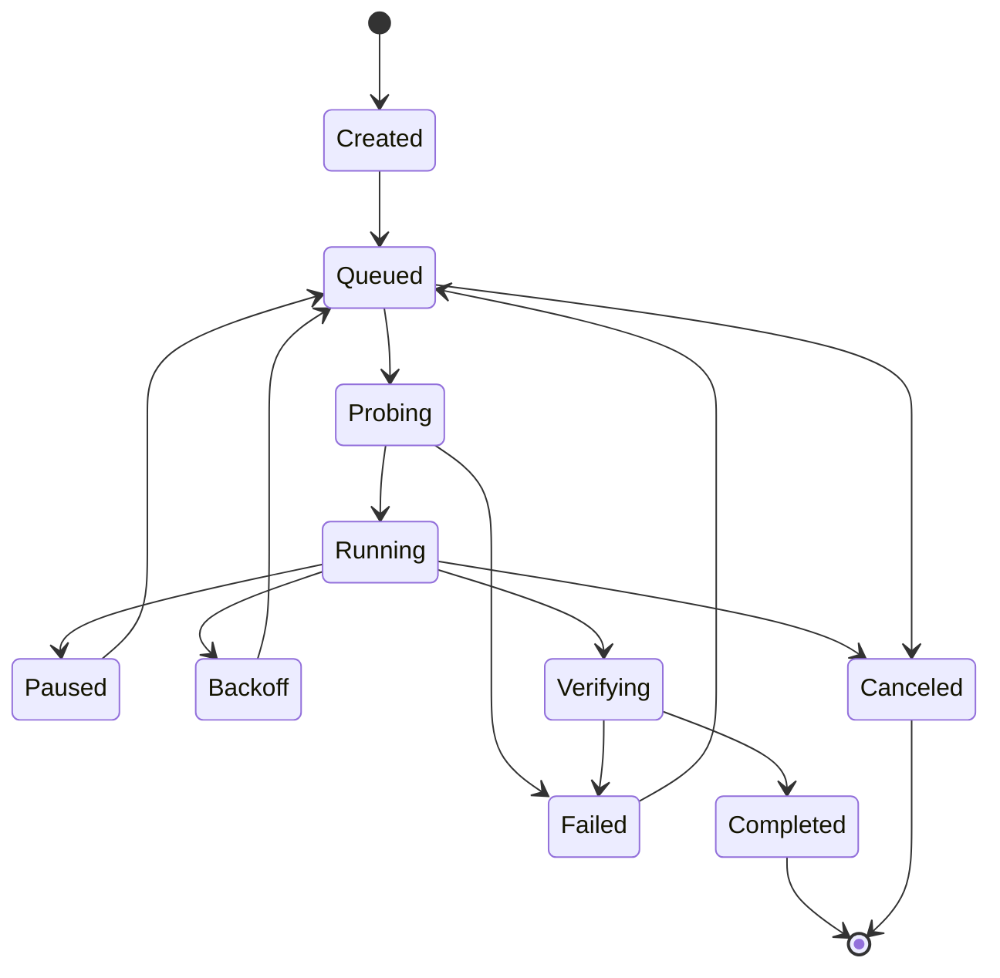
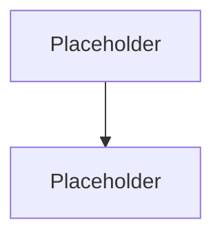

# Design Doc: `DownloadManagerV2`

---

## 0. TODO

* add filesystem navigator
* Make Adding new downloads to the active_transfer list safe when adding new downloads while original ones are still ongoing
* Make reactor shutdown and libcurl lifetime fully RAII-safe. 
* Implement completion/error/state handling. 
* Fix EventManager callback locking and subscriber lifetimes. 
* Then implement pause/resume/progress and eventually the scheduler/persistence layers.

---

## 1. Objective

Multi-Platform download manager that supports reliable HTTP/HTTPS downloads, pause/resume, progress tracking, using SDL3.

---

## 2. Summary

Give a short overview of the proposed design.

This should be readable by someone who does not know the implementation details yet.

Include:

* What problem this solves.
* The high-level approach.
* The most important technical choices.
* Any major risks or tradeoffs.

```text
Summary:
<Write a concise overview of the design.>
```

---

## 3. Background / Problem Statement

Explain why this project exists.

Answer:

* What problem are we solving?
* Who experiences this problem?
* What currently exists?
* Why is the current approach insufficient?
* What constraints or previous attempts matter?

```text
Background:
<Explain the context and motivation.>
```

---

## 4. Goals

List the outcomes this design must achieve.

Prefer user-visible or system-level outcomes over implementation details.

Good goals:

* Downloads can be paused and resumed after application restart.
* The UI remains responsive while multiple downloads are active.
* Failed downloads produce clear, actionable error messages.
* Download state is persisted safely enough to recover from crashes.

| Goal     | Reason             | Success Criteria          |
| -------- | ------------------ | ------------------------- |
| `<goal>` | `<why it matters>` | `<how we know it worked>` |

---

## 5. Non-Goals

List things that are explicitly out of scope.

This prevents scope creep and avoids reviewers assuming extra requirements.

Examples:

* This design does not implement BitTorrent support.
* This design does not implement browser integration.
* This design does not implement a plugin system in v1.
* This design does not guarantee maximum possible network throughput on every host.

| Non-Goal     | Reason                     |
| ------------ | -------------------------- |
| `<non-goal>` | `<why it is out of scope>` |

---

## 6. User Scenarios

Describe real workflows the completed system should support.

### Scenario 1: `<scenario name>`

1. `<User action>`
2. `<System behavior>`
3. `<Expected result>`

### Scenario 2: `<scenario name>`

1. `<User action>`
2. `<System behavior>`
3. `<Expected result>`

---

## 7. Requirements

### 7.1 Functional Requirements

| ID     | Requirement     | Priority | Notes     |
| ------ | --------------- | -------: | --------- |
| FR-001 | `<requirement>` |     Must | `<notes>` |
| FR-002 | `<requirement>` |   Should | `<notes>` |
| FR-003 | `<requirement>` |    Could | `<notes>` |

### 7.2 Non-Functional Requirements

| ID      | Requirement    | Target                                                         |
| ------- | -------------- | -------------------------------------------------------------- |
| NFR-001 | Responsiveness | `<example: UI event handling should not block on network I/O>` |
| NFR-002 | Reliability    | `<example: partial downloads survive process restart>`         |
| NFR-003 | Security       | `<example: TLS certificate verification enabled by default>`   |
| NFR-004 | Performance    | `<example: support N concurrent active downloads>`             |
| NFR-005 | Portability    | `<example: support Windows, Linux, and macOS>`                 |

---

## 8. Constraints

Document constraints that shape the design.

Examples:

* Language: C++20 or C++23.
* UI library: SDL3.
* Networking library: libcurl.
* Build system: CMake.
* Platforms: `<Windows / Linux / macOS>`.
* Persistence: `<SQLite / JSON / custom files / none>`.
* Packaging: `<CPack / platform-specific installers / none yet>`.

| Constraint     | Impact                        |
| -------------- | ----------------------------- |
| `<constraint>` | `<how it affects the design>` |

---

## 9. Proposed Design

### 9.1 High-Level Architecture

A split threaded design where UI is on one thread, and another thread for libcurl calls.
Keep track of 





### 9.2 Component Responsibilities

| Component           | Responsibility                         | Owns                                     | Does Not Own                |
| ------------------- | -------------------------------------- | ---------------------------------------- | --------------------------- |
| UI                  | `<rendering, input, view model>`       | `<SDL objects>`                          | `<network handles>`         |
| Download Controller | `<public app operations>`              | `<commands, high-level state>`           | `<raw socket/file details>` |
| Scheduler           | `<queueing, priorities, retry policy>` | `<pending work>`                         | `<UI widgets>`              |
| Network Reactor     | `<libcurl multi loop>`                 | `<CURLM*, active CURL*>`                 | `<SDL renderer>`            |
| File Store          | `<partial files, atomic finalize>`     | `<file handles>`                         | `<UI state>`                |
| Repository          | `<persistent metadata>`                | `<database connection / metadata files>` | `<network handles>`         |
| Logger / Metrics    | `<diagnostics>`                        | `<logs, counters>`                       | `<business logic>`          |

---

## 10. Data Model

Define the important domain objects.

### 10.1 Core Entities

```cpp
using DownloadId = std::uint64_t;

enum class DownloadState {
    Created,
    Queued,
    Probing,
    Running,
    Paused,
    Backoff,
    Verifying,
    Completed,
    Failed,
    Canceled
};

struct DownloadSpec {
    std::string url;
    std::filesystem::path target_path;
    int priority;
    bool allow_parallel_chunks;
};

struct DownloadSnapshot {
    DownloadId id;
    DownloadState state;
    std::uint64_t bytes_done;
    std::optional<std::uint64_t> bytes_total;
    double bytes_per_second;
};
```

### 10.2 Persistent State

Describe what must survive application restart.

| Field           | Type     | Description     |
| --------------- | -------- | --------------- |
| `id`            | `<type>` | `<description>` |
| `url`           | `<type>` | `<description>` |
| `target_path`   | `<type>` | `<description>` |
| `part_path`     | `<type>` | `<description>` |
| `state`         | `<type>` | `<description>` |
| `bytes_done`    | `<type>` | `<description>` |
| `total_bytes`   | `<type>` | `<description>` |
| `etag`          | `<type>` | `<description>` |
| `last_modified` | `<type>` | `<description>` |
| `created_at`    | `<type>` | `<description>` |
| `updated_at`    | `<type>` | `<description>` |

---

## 11. State Machines

### 11.1 Download Lifecycle



### 11.2 State Invariants

List rules that must always be true.

* A completed download must have a finalized output file.
* A canceled download must not continue network activity.
* A paused download must not own active transfer handles.
* A failed download must contain a user-visible error.
* A resumed download must validate that the partial file still matches the remote resource.

---

## 12. Interfaces

Describe the major APIs, boundaries, or message types.

### 12.1 Public Application Interface

```cpp
class IDownloadController {
public:
    virtual ~IDownloadController() = default;

    virtual DownloadId submit(DownloadSpec spec) = 0;
    virtual void pause(DownloadId id) = 0;
    virtual void resume(DownloadId id) = 0;
    virtual void cancel(DownloadId id) = 0;
    virtual DownloadSnapshot snapshot(DownloadId id) const = 0;
};
```

### 12.2 Internal Commands

| Command          | Producer | Consumer   | Meaning         |
| ---------------- | -------- | ---------- | --------------- |
| `SubmitDownload` | UI / CLI | Controller | `<description>` |
| `PauseDownload`  | UI / CLI | Reactor    | `<description>` |
| `ResumeDownload` | UI / CLI | Scheduler  | `<description>` |
| `CancelDownload` | UI / CLI | Reactor    | `<description>` |

### 12.3 External Interfaces

Document any external systems, protocols, files, or config formats.

| Interface              | Type                 | Description     |
| ---------------------- | -------------------- | --------------- |
| Config file            | `<JSON/TOML/YAML>`   | `<description>` |
| Partial download files | `<filesystem>`       | `<description>` |
| Metadata database      | `<SQLite/file/etc.>` | `<description>` |
| HTTP/HTTPS servers     | `<network>`          | `<description>` |

---

## 13. Concurrency Model

Describe thread ownership and communication.

| Thread / Execution Context | Owns                                   | Communicates With    | Mechanism                       |
| -------------------------- | -------------------------------------- | -------------------- | ------------------------------- |
| UI Thread                  | `<SDL window, renderer, UI state>`     | Controller           | `<direct call / command queue>` |
| Network Reactor Thread     | `<libcurl multi handle, easy handles>` | UI / Repository      | `<message queue>`               |
| Persistence Thread         | `<database connection>`                | Controller / Reactor | `<repository jobs>`             |
| Worker Pool                | `<optional CPU/file work>`             | Reactor              | `<bounded queue>`               |

### 13.1 Ownership Rules

* SDL objects are only accessed on the UI thread.
* libcurl handles are only accessed on the network reactor thread.
* Persistent metadata writes go through the repository layer.
* Cross-thread communication uses value-type messages.
* No component exposes mutable internal state directly to another thread.

### 13.2 Synchronization Strategy

Explain the locking/message-passing approach.

```text
Synchronization Strategy:
<Describe queues, mutexes, atomics, condition variables, wakeups, or event notifications.>
```

---

## 14. Error Handling

Define error categories and how the system responds.

| Error Class       | Example                         | Retry? | User Visible? | Handling                   |
| ----------------- | ------------------------------- | -----: | ------------: | -------------------------- |
| Network transient | Timeout                         |    Yes |           Yes | `<backoff/retry>`          |
| Network permanent | 404 Not Found                   |     No |           Yes | `<mark failed>`            |
| TLS/security      | Certificate verification failed |     No |           Yes | `<fail securely>`          |
| Storage           | Disk full                       |  Maybe |           Yes | `<pause/fail>`             |
| Integrity         | Hash mismatch                   |     No |           Yes | `<delete/quarantine/fail>` |
| Internal bug      | Invalid state transition        |     No |         Maybe | `<assert/log/fail safely>` |

### 14.1 Retry Policy

```text
Retry Policy:
<Describe max retries, backoff, jitter, retryable status codes, and user override behavior.>
```

---

## 15. Performance Design

Describe the expected performance characteristics and the main bottlenecks.

### 15.1 Complexity / Data Structures

| Concern             | Data Structure                    | Reason     |
| ------------------- | --------------------------------- | ---------- |
| Download lookup     | `<unordered_map / map / vector>`  | `<reason>` |
| Scheduling          | `<priority_queue / heap>`         | `<reason>` |
| Retry timers        | `<min-heap>`                      | `<reason>` |
| Completed ranges    | `<sorted vector / interval tree>` | `<reason>` |
| UI progress samples | `<ring buffer>`                   | `<reason>` |

### 15.2 Expected Bottlenecks

* Network throughput.
* Disk write throughput.
* Metadata persistence frequency.
* UI update frequency.
* Lock contention.
* Memory usage from buffering.
* Too many active connections.

### 15.3 Performance Targets

| Metric                 |    Target | Measurement Method   |
| ---------------------- | --------: | -------------------- |
| Max active downloads   |     `<N>` | `<test/profiler>`    |
| UI frame time          |  `<N ms>` | `<instrumentation>`  |
| Metadata write latency |  `<N ms>` | `<benchmark>`        |
| Resume startup time    |  `<N ms>` | `<integration test>` |
| Memory usage           | `<N MiB>` | `<profiler>`         |

---

## 16. Security

Describe the threat model and security posture.

### 16.1 Threats Considered

| Threat                            | Risk     | Mitigation     |
| --------------------------------- | -------- | -------------- |
| Malicious URL                     | `<risk>` | `<mitigation>` |
| TLS man-in-the-middle             | `<risk>` | `<mitigation>` |
| Path traversal / unsafe filenames | `<risk>` | `<mitigation>` |
| Corrupted partial download        | `<risk>` | `<mitigation>` |
| Sensitive data in logs            | `<risk>` | `<mitigation>` |

### 16.2 Security Defaults

* TLS certificate verification is enabled by default.
* Hostname verification is enabled by default.
* Redirect behavior is restricted and validated.
* Downloaded files are written to temporary `.part` paths before finalization.
* Logs avoid storing secrets, tokens, cookies, or full sensitive URLs.
* User-provided paths are normalized and validated.

---

## 17. Privacy

Describe what user data the system handles.

| Data                 | Stored? | Retention    | Protection     |
| -------------------- | ------: | ------------ | -------------- |
| Download URL         |  Yes/No | `<duration>` | `<protection>` |
| Destination path     |  Yes/No | `<duration>` | `<protection>` |
| Error logs           |  Yes/No | `<duration>` | `<protection>` |
| Credentials / tokens |  Yes/No | `<duration>` | `<protection>` |

---

## 18. Logging, Metrics, and Observability

### 18.1 Logs

Document what gets logged.

| Event               | Level   | Fields     |
| ------------------- | ------- | ---------- |
| Application startup | Info    | `<fields>` |
| Download submitted  | Info    | `<fields>` |
| Download failed     | Error   | `<fields>` |
| Retry scheduled     | Warning | `<fields>` |
| Verification failed | Error   | `<fields>` |

### 18.2 Metrics

| Metric                   | Type    | Purpose     |
| ------------------------ | ------- | ----------- |
| `downloads_active`       | Gauge   | `<purpose>` |
| `downloads_failed_total` | Counter | `<purpose>` |
| `bytes_downloaded_total` | Counter | `<purpose>` |
| `download_rate_bps`      | Gauge   | `<purpose>` |
| `retry_count_total`      | Counter | `<purpose>` |

---

## 19. Testing Strategy

### 19.1 Unit Tests

| Area                 | Test Cases                                 |
| -------------------- | ------------------------------------------ |
| State machine        | `<valid transitions, invalid transitions>` |
| Scheduler            | `<priority, fairness, retry timing>`       |
| Range tracking       | `<merge, overlap, gaps>`                   |
| Path validation      | `<safe paths, unsafe paths>`               |
| Error classification | `<retryable vs terminal>`                  |

### 19.2 Integration Tests

| Scenario                     | Expected Result |
| ---------------------------- | --------------- |
| Successful small download    | `<expected>`    |
| Pause and resume             | `<expected>`    |
| Resume after process restart | `<expected>`    |
| Server ignores range request | `<expected>`    |
| Disk full simulation         | `<expected>`    |
| TLS verification failure     | `<expected>`    |

### 19.3 Stress / Performance Tests

| Test                         | Purpose                               |
| ---------------------------- | ------------------------------------- |
| `<N>` queued downloads       | Validate scheduler and memory use     |
| Repeated pause/resume/cancel | Find race conditions                  |
| Slow server responses        | Validate timeout and retry behavior   |
| Large file download          | Validate throughput and file handling |

---

## 20. Migration / Compatibility

Use this section if the design changes existing storage, APIs, configs, or user workflows.

| Existing Behavior | New Behavior | Migration Plan |
| ----------------- | ------------ | -------------- |
| `<old>`           | `<new>`      | `<plan>`       |

---

## 21. Rollout Plan

Describe how this will be implemented and released.

| Phase   | Deliverable              | Validation          |
| ------- | ------------------------ | ------------------- |
| Phase 1 | `<skeleton / prototype>` | `<how to validate>` |
| Phase 2 | `<core feature>`         | `<how to validate>` |
| Phase 3 | `<hardening>`            | `<how to validate>` |
| Phase 4 | `<release>`              | `<how to validate>` |

---

## 22. Risks

| Risk     |       Impact |   Likelihood | Mitigation     |
| -------- | -----------: | -----------: | -------------- |
| `<risk>` | High/Med/Low | High/Med/Low | `<mitigation>` |

---

## 23. Alternatives Considered

Document strong alternatives and why they were rejected.

| Alternative     | Pros     | Cons     | Decision                |
| --------------- | -------- | -------- | ----------------------- |
| `<alternative>` | `<pros>` | `<cons>` | `<why rejected/chosen>` |

---

## 24. Open Issues

Track unresolved questions.

Each open issue should include:

* The problem.
* Options being considered.
* The next step.
* Who owns the decision.

### Open Issue 1: `<title>`

**Problem:**
`<description>`

**Options:**

1. `<option>`
2. `<option>`
3. `<option>`

**Next Step:**
`<specific action>`

**Owner:** `<name>`

---

## 25. Resolved Issues / Decision Log

Move resolved open issues here so future readers understand why decisions were made.

| Date           | Decision     | Rationale | Alternatives     |
| -------------- | ------------ | --------- | ---------------- |
| `<YYYY-MM-DD>` | `<decision>` | `<why>`   | `<alternatives>` |

---

## 26. Review Checklist

Use this before requesting review.

* [ ] Objective is clear in the first page.
* [ ] Goals and non-goals are explicit.
* [ ] Major design choices are explained.
* [ ] Important alternatives are documented.
* [ ] State ownership and lifetimes are clear.
* [ ] Threading/concurrency model is clear.
* [ ] Error handling strategy is clear.
* [ ] Security and privacy implications are considered.
* [ ] Performance targets are measurable.
* [ ] Testing strategy covers core risks.
* [ ] Open issues have owners and next steps.
* [ ] Diagrams are editable or source-controlled.

---

## 27. Build Instructions
```
conan install . --build=missing -s:h build_type=Debug --output-folder=.out
```

## 28. Appendix

Use this section for details that are useful but not required for understanding the main design.

### Appendix A: Glossary

| Term     | Definition     |
| -------- | -------------- |
| `<term>` | `<definition>` |

### Appendix B: References

| Reference | Description     |
| --------- | --------------- |
| `<link>`  | `<description>` |

### Appendix C: Extra Diagrams


